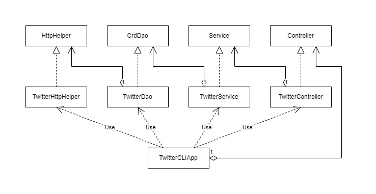

# Introduction

---
This project will perform CRUD operations (Only Create, Delete, Read since you cannot update on twitter) using Twitter API. This application uses the 
MVC (Model, View, Controller). The View aspect of MVC was not implemented, but the Controller and Mode was used to separate the logic from the model. 
This application will create HTTP requests using OAuth 1.0. The Twitter Developer account (given elevated access), generates an SSH keys, for authentication.
The frameworks that was used were primarily spring, while testing was done with JUnit and Mockito. Maven was used to build and manage the project.
Docker image was used to deploy. 

## Quick Start

---

First package the app using: **mvn clean package**. You can run the app by building the docker image: **docker build -t twitter_app .**.
To execute this CRUD operation on this app, and to connect to twitter API, you would first need the following environmental variables.
>consumerKey: API key that is generated. This key identifies who is making the request (Authentication)
> consumerSecret: Secret that can be unlocked with the consumer key. Basically the password to the key.
> accessToken: This token defines the privileges of the consumer.
> tokenSecret: Secret to be unlocked by access token.

To post a tweet, use this following command: 
>docker run --rm \
>-e consumerKey \
>-e consumerSecret \
>-e accessToken \
>-e tokenSecret \
>twitter_app post "tweet_text" "latitude:longitude"

To read a tweet, use this following command:
> docker run --rm \
>-e consumerKey=YOUR_VALUE \
>-e consumerSecret=YOUR_VALUE \
>-e accessToken=YOUR_VALUE \
>-e tokenSecret=YOUR_VALUE \
>jrvs/twitter_app show "tweet_id" [field]

To delete a tweet, use this following command:
docker run --rm \
>-e consumerKey=YOUR_VALUE \
>-e consumerSecret=YOUR_VALUE \
>-e accessToken=YOUR_VALUE \
>-e tokenSecret=YOUR_VALUE \
>jrvs/twitter_app delete [id]


##Design

---



### Components

---

- **HttpHelper**: Handles the calls and requests, given the URI
- **CrdDao**: Prepares the URI and passes it onto the HttpHelper
- **Service**: Handles the logic to make sure only valid requests are made
- **Controller**: Extracts the users input and inputs the right request into the services
- **TwitterCLIApp**: Initializes and runs the application

### Models

---

Models are implemented using POJO (Plain Old Java Object) in mind. There are 3 models. **Tweet Object**, **Entity Object**, and **Coordinates Object**.
Here are the fields that are within each object:

- Tweet Object
```
{
     "created_at":"Mon Feb 18 21:24:39 +0000 2019",
     "id":1097607853932564480,
     "id_str":"1097607853932564480",
     "text":"test with loc223",
     "entities":{
        "hashtags":[],      
        "user_mentions":[]  
     },
     "coordinates":null,   
     "retweet_count":0,
     "favorite_count":0,
     "favorited":false,
     "retweeted":false
  }
```

- Entity Object
```
  "hashtags":[],      
  "user_mentions":[] 
```

-Coordinates Object
> "Coordinates": [0,0]


### Spring

---

Spring framework was used with the Inversion of Control(IOC) in mind. This means that dependencies are defined in each objects, and are injected into
the object through constructor arguments. These objects that can be instantiated and managed by spring are called beans. 

## Test

---

There are two types of testing that was utilised. Unit Testing and Integration testing. 

1. Unit Test: This was done using Mockito. Mockito helps create mock objects of dependency classes and injects into them. This requires less and overall cleaner code.
2. Integration Testing: JUnit 4 was used. Components were used with @Before annotation to set up the classes. The results of each test ran is then tested with assert statements.

## Deployment

---

Application is deployed using Maven. It is packaged as a jar file. Docker is the used to create an image which is pushed onto Docker Hub. 

## Improvements

---

- Since the application was built using MVC architecture in mind, the next logical step would be to implement a graphical user interface. 
- Twitter is not using version 2.0. Which will be a good stepping stone into upgrading the Authorization and authentication process to version 2.0.
