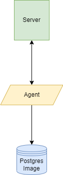

# Linux Cluster Monitoring Agent
___
## Introduction
This project is a building block to eventually manage a cluster of 10 server that runs the CentOS 7. Ideally the servers
are connected to a switch which enables them to communicate. This project will include scripts that are written in bash
and PSQL, which will show the hardware usage and specifications of the local machine. This is saved to a PostgresSQL
container that is created from the docker hub. The machine uses CRON to update the data to the server on each minute.
<!-- Horizontal Rule -->
### Architecture and Design

This is the basic flow of the program. The agent will track the data changes every minute, and this will be logged in to
the database. Ideally we should have multiple servers and the data will be logged on to the database. 
<!-- Horizontal Rule -->
### Database and tables
The data is stored in the data base host_agent. It consists of two tables. The host_info and the host_usage.
The host_info has a one-to-one relationship with host_usage, this means that the primary key of host_info will also
be the foreign and primary key of host_usage. Here is the table for the database:

<!-- Tables -->
#### host_info

|id|hostname|cpu_number|cpu_architecture|cpu_model|cpu_mhz|L2_cache|total_mem|timestamp|
|--|--------|----------|----------|----------------|---------|---------|-------|--------|
|PK|VARCHAR|INTEGER|VARCHAR|VARCHAR|NUMERIC|INTEGER|INTEGER|DATE|

<!-- Tables -->
#### host_usage
|timestamp|host_id|memory_free|cpu_idle|cpu_kernel|disk_io|disk_available|
|---------|-------|-----------|---------|---------|--------|-------------|
|DATE|PK/FK|INTEGER|INTEGER|INTEGER|INTEGER|INTEGER|
<!-- Horizontal Rule -->
### Scripts
There are 3 Bash scripts and 1 DDL script. 
`host_info.sh` logs the nodes hardwaare specification on the table. 
`host_usage` logs the nodes hardware usage. This is autamated every minute using cron.
`psql_docker` pulls a docker container and creates a image of the postgres database that iwll be used to save the data.
`ddl.sql` creates a host_agent database and table that will contain host_info and host_usage.
<!-- Horizontal Rule -->
### Improvements
Implementing an agent that will handle the communication with the different nodes, and save them correctly into the 
database will be the next step.
